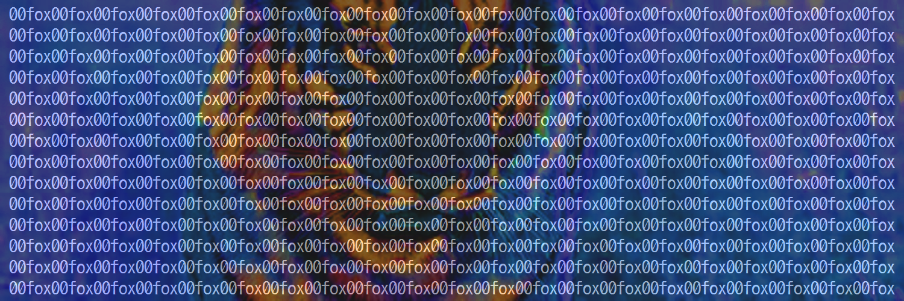

I am currently working on an addon for World of Warcraft, then I would add a wow template for Ds2vJoy, allowing to have the 32 buttons with a simple joystick of 15 or less in an efficient way.

<!--
**00fox/00fox** is a ✨ _special_ ✨ repository because its `README.md` (this file) appears on your GitHub profile.
Here are some ideas to get you started:

- 🔭 I’m currently working on ...
- 🌱 I’m currently learning ...
- 👯 I’m looking to collaborate on ...
- 🤔 I’m looking for help with ...
- 💬 Ask me about ...
- 📫 How to reach me: ...
- 😄 Pronouns: ...
- ⚡ Fun fact: ...
-->
